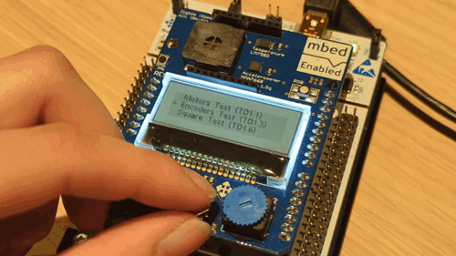
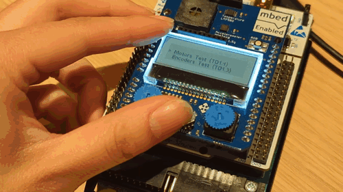
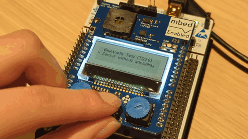

# Tests for the STM32-based autonomous buggy

This repository contains the code for the program with all of the tests used for the project.

| Main Menu | Example test | Test with error |
| --------- | ------------ | --------------- |
|  |  |  |
| Pressing up/down navigates the list | Testing potentiometer values and motor speed (not connected) | An example of a faulty test, which returns to the main menu |

## Related links 

- [Mbed OS bare metal](https://os.mbed.com/docs/mbed-os/latest/reference/mbed-os-bare-metal.html).
- [Mbed OS configuration](https://os.mbed.com/docs/latest/reference/configuration.html). 
- [Mbed OS serial communication](https://os.mbed.com/docs/latest/tutorials/serial-communication.html). 
- [Mbed boards](https://os.mbed.com/platforms/).

### License and contributions

The software is provided under the Apache-2.0 license. Contributions to this project are accepted under the same license. Please see [contributing.md](./CONTRIBUTING.md) for more information.

This project contains code from other projects. The original license text is included in those source files. They must comply with our license guide.
